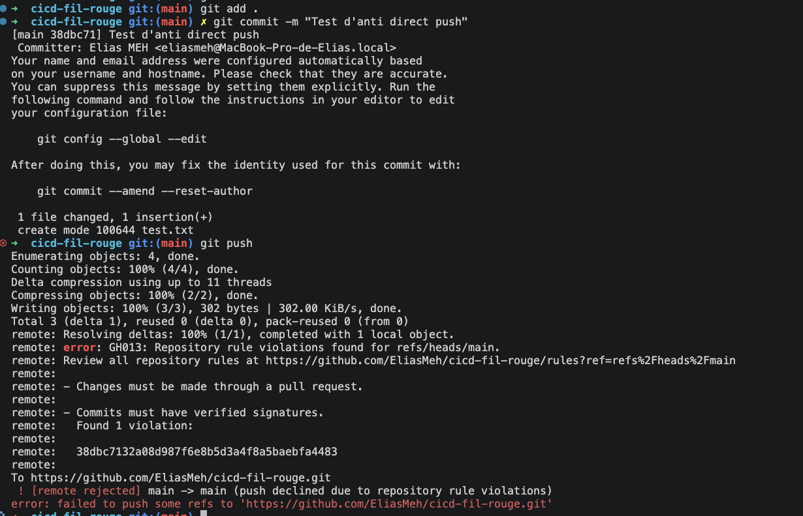

# TaskFlow — dépôt fil rouge CI/CD

TaskFlow est une petite API de gestion de tâches écrite en Python avec FastAPI.
C'est le projet fil rouge du module CI/CD (Mastère DevOps M1, Sup de Vinci) :
pendant trois jours, vous allez construire autour d'elle un pipeline complet
qui teste, construit, sécurise et livre l'application.

## Lancer l'API en local

Prérequis : Python 3.10 ou plus récent.

```bash
python3 -m venv .venv
source .venv/bin/activate          # Windows : .venv\Scripts\activate
pip install -r requirements-dev.txt
uvicorn app.main:app --reload
```

L'API répond sur http://localhost:8000 et sa documentation interactive est sur
http://localhost:8000/docs.

## Vérifier le code

```bash
pytest           # tests automatiques
ruff check .     # lint
ruff format .    # mise en forme
```

## Lancer avec Docker

```bash
docker build -t taskflow .
docker run --rm -p 8000:8000 taskflow
```

## Endpoints

| Méthode | Chemin | Rôle |
| --- | --- | --- |
| GET | `/health` | État de l'API et version |
| GET | `/tasks` | Liste des tâches |
| GET | `/tasks/search?q=...` | Recherche dans les titres |
| POST | `/tasks` | Crée une tâche (`{"title": "..."}`) |
| GET | `/tasks/{id}` | Détail d'une tâche |
| PATCH | `/tasks/{id}/done` | Marque une tâche comme faite |
| DELETE | `/tasks/{id}` | Supprime une tâche (en-tête `X-API-Token` requis) |

## Configuration

| Variable | Rôle | Défaut |
| --- | --- | --- |
| `APP_VERSION` | Version affichée par `/health` | `0.1.0` |
| `DB_PATH` | Fichier SQLite | `taskflow.db` |
| `API_TOKEN` | Jeton exigé pour supprimer une tâche | vide (suppression désactivée) |
| `NOTIFY_WEBHOOK_URL` | Webhook appelé à chaque création de tâche | vide (désactivé) |

## Équipe
Elias MEHDAOUI

## Gouvernance du dépôt

Sur la branche `main`, plusieurs protections ont été activées pour sécuriser le dépôt :

- `Require pull request before merging` : un code validé par une PR doit être relu avant d’être fusionné.
- `Require status checks to pass before merging` : la CI doit être verte (lint + tests) avant toute merge.
- `Require branches to be up to date before merging` : la branche doit être synchronisée avec `main` avant fusion.
- `Do not allow force pushes` : cela évite les réécritures de l’historique et les suppressions accidentelles.

Ces règles permettent de s’assurer qu’aucun changement non vérifié n’est intégré dans la branche principale.

### Exemple de push refusé



### Vérification des règles de protection


### Vérification du statut de la CI


### PR bloquée par la CI


### Validation du merge final


### Règle de protection supplémentaire


### Contrôle de la branche principale


### Vérification avant merge


### État final de la protection


## Ce que la pipeline vérifie

La pipeline CI GitHub Actions est conçue pour protéger la branche principale avant tout merge.
Elle lance deux contrôles en parallèle sur chaque PR et sur chaque push vers la branche principale :

- le lint avec Ruff
- les tests avec Pytest

Le but est simple : une PR ne peut pas être fusionnée si au moins un de ces contrôles échoue.
Cela permet de garder la branche `main` stable, de détecter rapidement les régressions et d'éviter d'intégrer du code qui n'a pas été validé.

DONC :
code de qualité et tests qui fonctionnent et qui existent

Rend les merges fiables